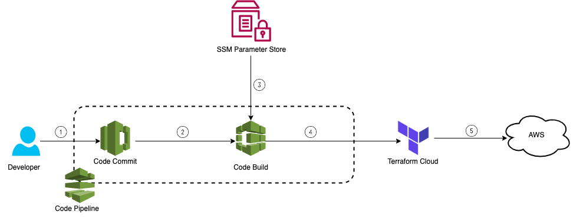

# codecommit-as-vcs-for-tfc

## License Summary

This sample code is made available under a modified MIT license. See the LICENSE file.

## Description
Terraform Cloud(TFC) doesn’t provide integration with AWS Code Commit by default. This solution provides CDK code which uses API-driven workflow in integrating AWS Code Commit with TFC and thus enabling Version Control System(VCS) managed development of your terraform templates and automatically initiates a ***terraform run*** when changes are made to a specified  Code Commit branch.

## Architecture

1. Developer modifies/updates the terraform templates and pushes them to AWS CodeCommit.
2. CodeBuild pulls the latest changes from CodeCommit
3. CodeBuild  fetches the token stored in SSM Parameter Store.
4. Once the authentication is successful, these changes are then pushed to Terraform cloud
5. Terraform Cloud then executes the *terraform plan* and *terraform apply* accordingly against your infrastructure provider.

## Useful commands

* `npm run build`   compile typescript to js
* `npm run watch`   watch for changes and compile
* `npm run test`    perform the jest unit tests
* `cdk deploy`      deploy this stack to your default AWS account/region
* `cdk diff`        compare deployed stack with current state
* `cdk synth`       emits the synthesized CloudFormation template

## Guidance

For prerequisites and instructions for using this AWS Prescriptive Guidance pattern, see ***[AWS Code Commit as a VCS for Terraform Cloud](https://apg-library.amazonaws.com/content-viewer/author/d91a75ad-8434-4069-a65f-dafa17541010)***
